Hi! I'm <abbr title="IPA: [ɑˈt̪eʃ ɟœɾɑɫ]">Ateş Göral</abbr>. I enjoy writing code, tinkering with graphics, experimenting with electronics, and executing ambitious DIY projects.

I'm a self-taught programmer with 25+ years of professional and 35+ years of hobbyist experience. I'm a telco and web veteran with both breadth and depth, spanning multiple programming languages, disciplines, and technologies. I also have an ornamental Associate of Science degree in Molecular Biology and Genetics.

I'm currently working at [Shopify](https://www.shopify.com) on AI stuff ([Sidekick](https://www.shopify.com/magic)).

Past: [Orium](https://orium.com/) (Myplanet), [Genesys](https://www.genesys.com/) (Alcatel-Lucent, VoiceGenie), PhonoClick, Turk Nokta Net. And a whole bunch of odd jobs.

## Elsewhere

- [Twitter / <del>X</del>](https://twitter.com/atesgoral): I project-log, dad-joke, and sub-tweet.
- [Dwitter](https://www.dwitter.net/u/magna/top) (JavaScript golfing): By day, a paragon of verbose, readable code – by night, a wizard of terse, cryptic JavaScript.
- [GitHub](https://github.com/atesgoral): I open-source whatever I can. Usually fringe stuff.
- [npm](https://www.npmjs.com/~atesgoral): I publish whatever I can. Usually fringe stuff.
- [Hackaday](https://hackaday.io/atesgoral): I've developed a penchant for cracking open IKEA LED lamps to replace their graphics chips with single-board computers to run my own animations.
- [Stack Overflow](https://stackoverflow.com/users/23501/ates-goral): I used to actively post answers. After attaining moderator status, I just edit typos nowadays.
- [LinkedIn](https://www.linkedin.com/in/atesgoral/): I'm happy where I am, but open to expanding my network.
- [Observable](https://observablehq.com/@atesgoral): I just created a Dwitter runtime.
- [CodePen](https://codepen.io/atesgoral/): An unorganized mess of pens.

## Projects

Finished (mostly personal) projects in reverse chronological order.

---

### 2023

#### IKEA OBEGRÄNSAD Hack

{: .image-240x135}

[github.com/atesgoral/obegraensad-hack](https://github.com/atesgoral/obegraensad-hack) &middot; 2023
{: .meta}

I hacked an IKEA OBEGRÄNSAD LED wall lamp to replace its graphics chip with an ESP32 and wrote some C++, JavaScript and WebAssembly to run my own graphics on it.

---

### 2021

#### Airgap—True Analog Glitching by Transmitting Pixel Data Through Air

{: .image-240x135}

[atesgoral.github.io/airgap](https://atesgoral.github.io/airgap/) &middot; 2021
{: .meta}

Can we really get true analog/chaotic glitching with an entirely digital device? Using the screen as a signal source and the camera as a receiver, I experimented with transmitting a digital signal through the air, bouncing off random surfaces.

A source image is scanned pixel-by-pixel and the pixel value is drawn as a large square on the screen, close to where the webcam is. Something reflective (even the palm of a hand works) is cupped around the webcam and where the "signal" square is. After a calibration run, the image is transmitted through the reflector, picking up gnarly analog glitches.

---

### 2020

#### IKEA FREKVENS Hack

{: .image-240x135}

[hackaday.io/project/171034-frekvens-fjrrkontroll](https://hackaday.io/project/171034-frekvens-fjrrkontroll) &middot; [github.com/atesgoral/node-omega-frekvens](https://github.com/atesgoral/node-omega-frekvens) &middot; 2020
{: .meta}

I hacked an IKEA FREKVENS LED cube lamp to replace its graphics chip with an Onion Omega 2+ and wrote some C++, JavaScript to run my own graphics on it.

---

#### Binary Versioning

{: .image-240x135}

[binver.org](https://binver.org/) &middot; 2020
{: .meta}

A humourous spin on [Semantic Versioning](https://semver.org/). I apparently had too much free time on my hands (and disposable income to buy a new domain).

---

### 2018

#### MIDNIGHT TACTIX 3000

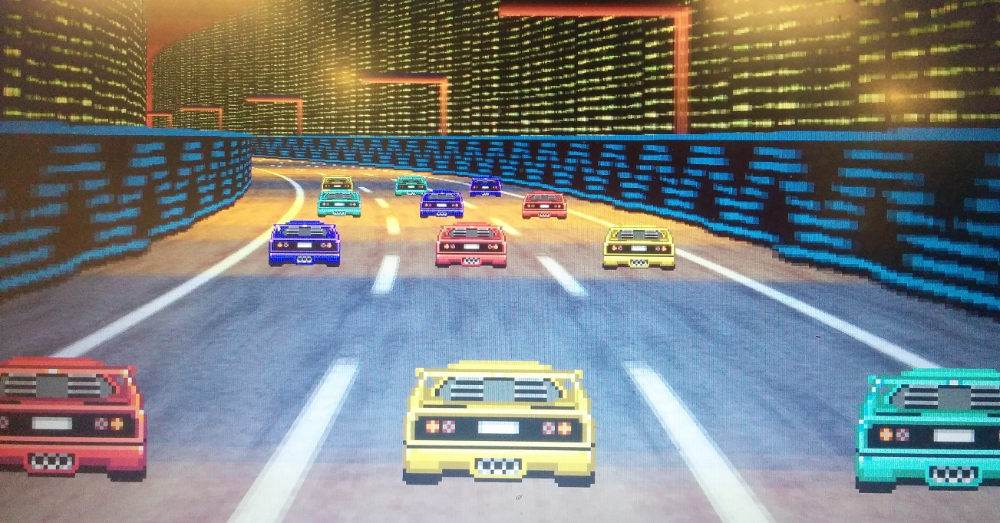
{: .image-240x135}

[github.com/psygnoscapes3000/midnight-tactix-3000](https://github.com/psygnoscapes3000/midnight-tactix-3000) &middot; 2018
{: .meta}

A multiplayer turn-based retro racing game we made with my friend [Nick Matantsev](https://unframework.com/) during [Toronto Game Jam (TOJam)](https://www.tojam.ca/) 13. Using mobile phones as controllers over time-synched WebSocket connections, with the game rendered in GLSL.

---

### 2017

#### JavaScript Libraries for Mobile Telecommunication Protocols

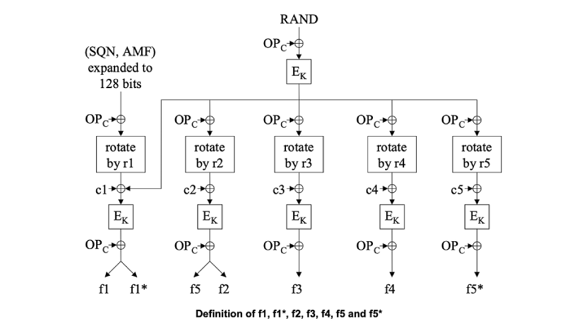
{: .image-240x135}

2017
{: .meta}

While working at Myplanet (now [Orium](https://orium.com/)), I had the unique and exciting opportunity to implement major components of a cloud-based iMVNO solution for one of Canada's largest mobile carriers, subsequently open-sourcing several JavaScript packages with the client's consent. This endeavor focused on creating critical telecommunication components, bridging both Diameter and SS7/SIGTRAN through a narrow waist of JSON structures.

The project was among the most tangible and satisfying undertakings of my career. The real-time testing involved a physical phone and SIM card, and witnessing a successful registration blip on my real-time React dashboard the moment I inserted the SIM card was consistently thrilling.

The JavaScript libraries I published encapsulate functionality for manipulating Diameter AVPs, encoding/decoding ASN.1 structures, handling 3GPP authentication and key generation, among other tasks.

- [MILENAGE](https://www.npmjs.com/package/milenage): 3GPP authentication and key generation functions. JavaScript implementation based on the C reference implementation from Annex 3 of [ETSI TS 135 206 V14.0.0 (2017-04)](http://www.etsi.org/deliver/etsi_ts/135200_135299/135206/14.00.00_60/ts_135206v140000p.pdf).
- [asn1-tree](https://www.npmjs.com/package/asn1-tree): Yet another ASN.1 encoder/decoder in JavaScript. Parses a binary ASN.1 buffer into a JavaScript object that describes the ASN.1 structure. Nested elements form a tree, and hence the name "asn1-tree", and a primitive value would just result in an object.
- [asn1-mapper](https://www.npmjs.com/package/asn1-mapper): ASN.1 schema mapper for semantic translation between [asn1-tree](https://www.npmjs.com/package/asn1-tree) structures and human-readable JavaScript values, using an ASN.1 expanded module definition (schema) that is converted with [asn1exp](https://www.npmjs.com/package/asn1exp) (e.g. [map-modules](https://www.npmjs.com/package/map-modules)).
- [asn1exp](https://www.npmjs.com/package/asn1exp): ASN.1 expanded module parser. This is not a universal parser. It was specifically made for parsing Expanded ASN.1 modules for [Mobile Application Part (MAP) (3GPP TS 29.002)](http://www.3gpp.org/ftp/specs/archive/29_series/29.002/ASN.1/).
- [map-modules](https://www.npmjs.com/package/map-modules): Expanded ASN.1 modules for [Mobile Application Part (MAP) (3GPP TS 29.002)](http://www.3gpp.org/ftp/specs/archive/29_series/29.002/ASN.1/) in JSON format. Converted using [asn1exp](https://www.npmjs.com/package/asn1exp).
- [diameter-avp-object](https://www.npmjs.com/package/diameter-avp-object): Syntactical sugar for manipulating node-diameter AVP arrays. I contributed this to the [node-diameter organization](https://github.com/node-diameter) and I'm a maintainer of [node-diameter](https://www.npmjs.com/package/diameter).
- [js0xn](https://www.npmjs.com/package/js0xn): A Buffer encoding/decoding scheme for JSON with the aim of keeping the payload human-readable and minimizing bloat. It's still standard JSON. Buffers are encoded as strings with the "0x" prefix.

---

#### put.io Starry Night

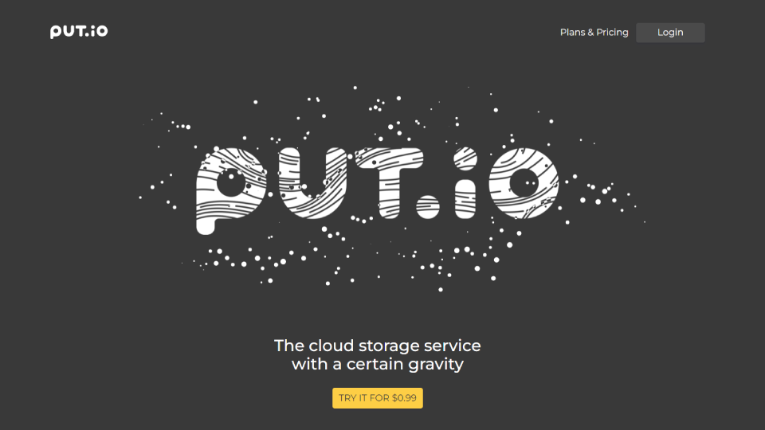
{: .image-240x135}

[put.io Starry Night](https://atesgoral.github.io/put.io.starry.night/) &middot; 2017
{: .meta}

This is a canvas-based animation I created to replace a large MP4 movie on the landing page of [put.io](https://put.io/). The project was a freelance commission by put.io.

I developed a tweakable version for the client to fine-tune the animation to their liking.

---

#### Dweet Player

{: .image-240x135}

[dweetplayer.net](https://dweetplayer.net) &middot; 2017
{: .meta}

[Dweet Player](https://dweetplayer.net) is an audiovisual sequencer for [dweets](https://www.dwitter.net) (visual effects in 140 characters of JavaScript, in the [demoscene](https://en.wikipedia.org/wiki/Demoscene) spirit).

I love looking at and [writing my own dweets](https://www.dwitter.net/u/magna/top). I wanted to string together a bunch of dweets and make them dance to some music. I created Dweet Player to sate that appetite.

Using an esoteric language in the query string, you sequence a bunch of dweets and apply timing and effects, and then specify an audio track. Dweet Player performs real-time beat detection of the audio track to make the dweets dance to the beat by morphing space (trig function outputs) and time (the `requestAnimationFrame` time stamp), as well applying some post-processing effects.

I gave [a talk](#dweet-player-1) about this project.

---

#### BD1K

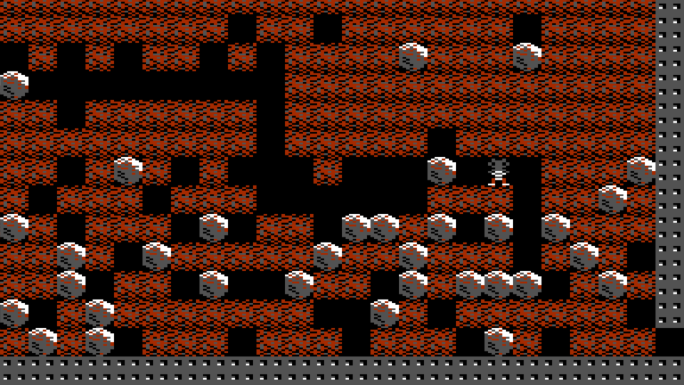
{: .image-240x135}

[atesgoral.github.io/bd1k](https://atesgoral.github.io/bd1k/) &middot; 2017
{: .meta}

A Boulder Dash clone in 1024 bytes of JavaScript (including the sprites from the original game). My contribution to [JS1k 2017 - Magic](https://js1k.com/2017-magic/).

---

### 2016

#### Doorbell Ringer—An Intentionally Complex IoT Project

{: .image-240x135}

[github.com/atesgoral/doorbell-ringer](https://github.com/atesgoral/doorbell-ringer) &middot; [github.com/atesgoral/doorbell-nudger](https://github.com/atesgoral/doorbell-nudger) &middot; 2016
{: .meta }

A very roundabout way of ringing a doorbell through a mixture of: electronics hacking, Onion Omega, Python, Node.js, Twitter streaming API, QR codes, TOTP, Travis CI. A story of learning through self-inflicted problems.

I gave [a talk](#doorbell-ringeran-intentionally-complex-iot-project-1) about this project.

---

### 2015

#### Human Resource Machine Solutions

{: .image-240x135}

[http://atesgoral.github.io/hrm-solutions](http://atesgoral.github.io/hrm-solutions/) &middot; 2015
{: .meta}

[Human Resource Machine](https://tomorrowcorporation.com/humanresourcemachine) is a fun, little, dark-humoured puzzle game that can either teach you assembly from the ground up, or allow you to apply your existing assembly knowledge in order to devise speed/size-optimized solutions to increasingly challenging problems.

This project started with me [publishing my own solutions](https://github.com/atesgoral/hrm-solutions) and then snowballed into a massive collaborative repository of solutions from some 80+ contributors. I've never had any of my open-source projects forked and PR'd this much.

---

#### Autonomous Cockroach

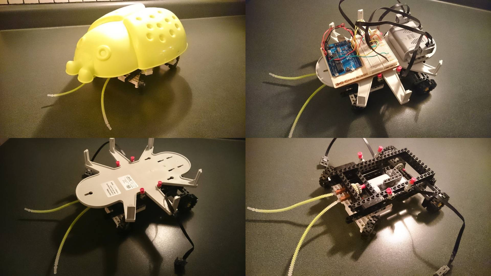
{: .image-240x135}

[hackaday.io/project/171720-cockroach](https://hackaday.io/project/171720-cockroach) &middot; [github.com/atesgoral/autonomous-cockroach](https://github.com/atesgoral/autonomous-cockroach) &middot; 2015
{: .meta}

This is the very first microcontroller (and IKEA lamp hack) project I did with an Arduino starter kit and (mostly) found parts. A LEGO drivetrain + two motors controlled by an Arduino Uno.

---

#### AngularJS Modules

{: .image-240x135}

2015
{: .meta}

While working at Myplanet (now [Orium](https://orium.com/)), I wrote or co-wrote several AngularJS modules that we published as packages. They are all pure CSS & JS and are compatible with IE8+.

I also created their live documentation and demo pages.

- [angular-color-picker](https://atesgoral.github.io/angular-color-picker/): A lightweight color picker that acts like a custom input element through regular [ngModel](https://docs.angularjs.org/api/ng/directive/ngModel) bindings.
- [angular-date-picker](https://atesgoral.github.io/angular-date-picker/): A lightweight date picker that acts like a custom input element through regular [ngModel](https://docs.angularjs.org/api/ng/directive/ngModel) bindings.
- [angular-deep-blur](https://atesgoral.github.io/angular-deep-blur/): Detects when neither the element nor any of its children are in focus (i.e. the element is blurred by the focusing of another element outside the element.) This is especially useful if you want to hide a dropdown on blur.
- [angular-tab-trap](https://atesgoral.github.io/angular-tab-trap/): Disallows tabbing out of a designated area. This is especially useful when implementing modal dialogs to prevent the user from interacting with what's behind a dialog / modal mask by simply tabbing out of the dialog.
- [angular-esc-action](https://atesgoral.github.io/angular-esc-action/): Allows you to attach an escape key handler to an element without having to locate the element within the DOM.
- [angular-auto-focus](https://atesgoral.github.io/angular-auto-focus/): The HTML autofocus attribute doesn't consistently work across different browsers when an element is inserted into the DOM after the initial page load. **angular-auto-focus** introduces the `auto-focus`` attribute that works consistently.
- [angular-pxy](https://atesgoral.github.io/angular-pxy/): Extends scope objects with a `$pxy()`` method that proxies promises through a [Pxy](https://github.com/atesgoral/pxy) instance that is automatically invalidated when the scope is destroyed.

---

### 2013

#### #direnturkce

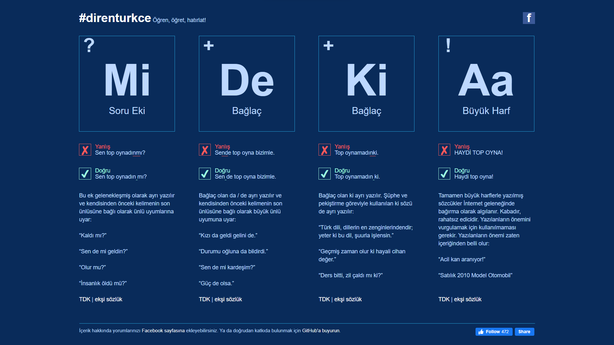
{: .image-240x135}

[direnturkce.org](https://direnturkce.org) &middot; 2013
{: .meta}

I have many pet peeves. I created a quick reference page for the most common misspellings in Turkish.

---

### 2009

#### jsUnity

{: .image-240x135}

[jsunity.com capture](https://web.archive.org/web/20120822153729/http://jsunity.com:80/) &middot; [github.com/atesgoral/jsunity](https://github.com/atesgoral/jsunity) &middot; 2009
{: .meta}

jsUnity is a lightweight, environment-agnostic JavaScript testing framework: It doesn’t rely on any browser capabilities and therefore can be used in any client-side or server-side JavaScript environment.

There were already several unit testing frameworks for JavaScript that were browser-centric. jsUnity aimed to just focus on JavaScript as a language that’s used beyond the browser context, at a time when Node.js was still in its infancy.

---

### 2005

#### browsersize.com

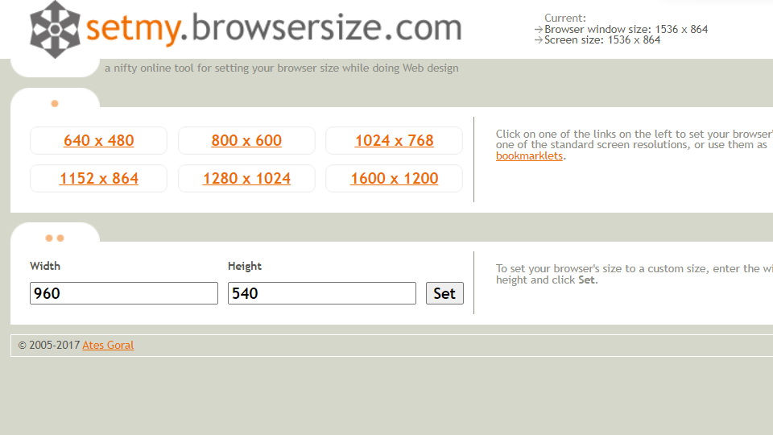
{: .image-240x135}

[browsersize.com](https://browsersize.com) &middot; 2005
{: .meta}

Browser resizing utility to aid in responsive web development.

It needs to be either updated or archived, as modern browsers have become more restrictive regarding the programmatic resizing of windows.

---

### 2003

#### The Unofficial Adobe Color Book File Format Specification

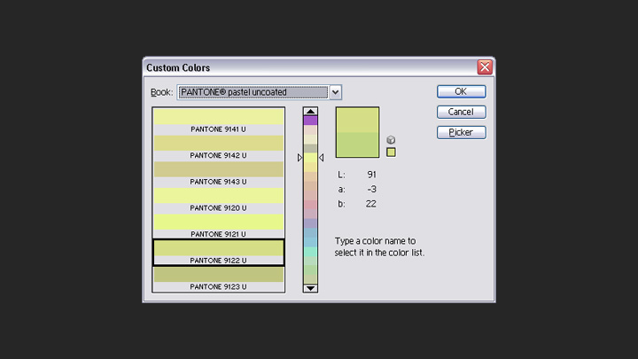
{: .image-240x135}

[Adobe Color Book File Format Specification](pages/acb-spec) &middot; 2003
{: .meta}

Adobe Photoshop's **Color Picker** has a **Custom Colors** dialog that offers a wide variety of colors from several industry-standard color catalogs such as ANPA, DIC, Focoltone and Pantone. The color catalog data comes from **Adobe Color Book** files.

Partly out of curiosity and partly because I needed the color data for a job, I went through reverse-engineering the file format since an official file format specification wasn't readily available. I have put together what I've come up with into an [unofficial file format specification](pages/acb-spec).

---

### 2002

#### Burrito

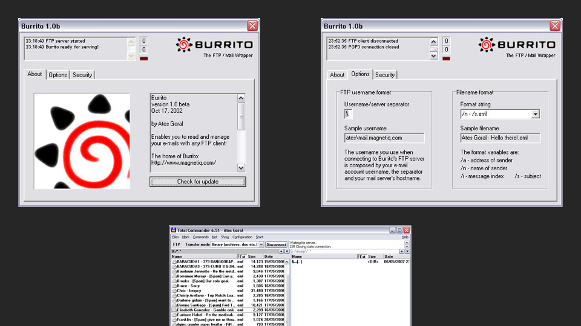
{: .image-240x135}

[Download Burrito 1.0 beta Installer](downloads/burrito10b.exe) &middot; 2002
{: .meta}

With Burrito you can read and manage your e-mails with any FTP client! It acts as a POP3/FTP protocol translator -- it's actually an FTP server that translates FTP commands to POP3 commands and serves your e-mail messages as individual files. You can view, delete and copy your e-mail messages as if they were files on an FTP server.

---

### 2000

#### Twofifty

{: .image-240x135}

[twofifty.net](https://twofifty.net) &middot; 2000
{: .meta}

Constraints stoke creativity. In that spirit, this is a showcase of digital art, strictly 250x250 pixels in dimensions, contributed by many different artists. (My own works are published as "MaGnA".)

Twofifty garnered popularity in the early 2000's and was featured in several websites and print publications.

I used hidden iframes to inject JavaScript into the parent frame to achieve a SPA (Single Page Application) before AJAX was a thing.

This is a static snapshot of the once PHP+MySQL-powered website.

---

### 1998

#### Win-Res-Q

{: .image-240x135}

[Download Win-Res-Q 1.0](downloads/WinResQ10.zip) &middot; 1998
{: .meta}

Win-Res-Q (pronounced "win rescue") is a simple utility that restores (shows) hidden windows. It can be used for bringing back your "lost" applications after their taskbar icons disappear following Explorer crashes that used to frequently occur on Windows 98. It's also useful for exposing strange, hidden windows lurking around your desktop.

---

#### E-Res-Q

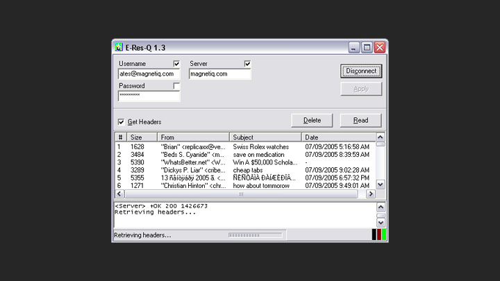
{: .image-240x135}

[Download E-Res-Q 1.3](downloads/EResQ13.zip) &middot; 1998
{: .meta}

E-Res-Q (pronounced "ee rescue") is a very simple, portable POP3 email reader. It enables you to selectively read and delete messages without having to download them all. It's ideal for getting rid of large messages that clog up your mailbox or getting rid of spam messages without even downloading them.

This small program has proved very useful back in the times when most of us still had dial-up connections. It's still a very useful utility for setting up quick access to your POP3 mailbox when you're temporarily using someone else's computer. The fact that it doesn't require installation is a plus. You just download the zip file, extract the binary and run it, punch in your account settings and you're ready to go!

---

### 1992

#### Bootsector Columns

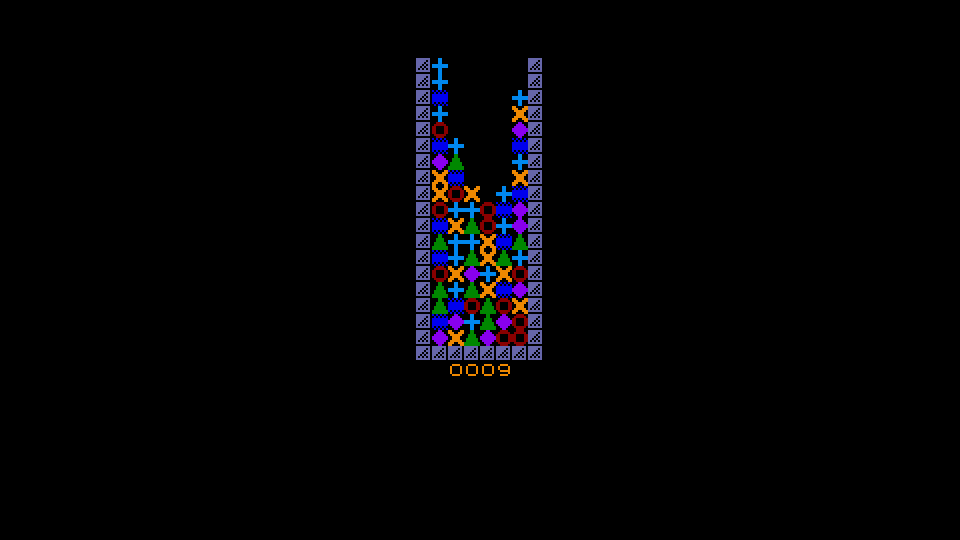
{: .image-240x135}

[github.com/atesgoral/bootsector-columns](https://github.com/atesgoral/bootsector-columns) &middot; 1992
{: .meta}

A [Columns](http://en.wikipedia.org/wiki/Columns_%28video_game%29) clone in 68000 assembly, for the Atari ST.

My initial intent was to fit it into the bootsector of a floppy disk (without any compression), but I overran the 450 or so free bytes I would have in the bootsector. I therefore ended up adding a bunch of text, graphics, and sound effects; and intentionally overran the limit even further (I went up to a whopping 1832 bytes).

The code could still run from the bootsector with a bit of cheating: I was storing the overrun in the FAT backup and therefore keeping the disk operational until a write operation on the disk would overwrite the FAT backup and screw up the game.

---

## Talks

While I'm not a frequent public speaker, I have had the opportunity to present a few talks in the past.

### 2017

#### Dweet Player

{: .image-240x135}

October 17, 2017 &middot; [Toronto Hack && Tell](https://www.meetup.com/Toronto-Hack-and-Tell/) &middot; [Slides](https://speakerdeck.com/atesgoral/dweet-player)
{: .meta }

A talk about my [Dweet Player project](#dweet-player). I won a Raspberry Pi as an audience award.

---

### 2016

#### Unit Testing—The Whys, Whens and Hows

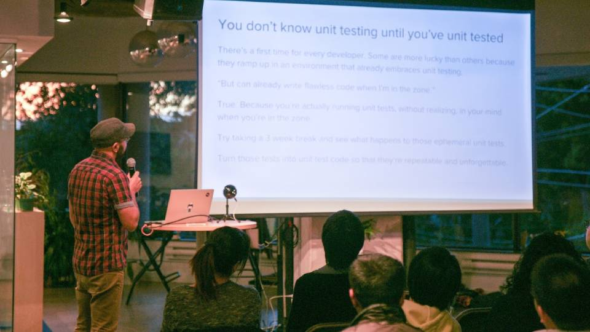
{: .image-240x135}

October 11, 2016 &middot; [Toronto Node.js](https://www.meetup.com/toronto-node-js/) &middot; [Slides](https://speakerdeck.com/atesgoral/unit-testing-the-whys-whens-and-hows)
{: .meta }

Talking about some best practices for unit testing in Node.js.

---

#### Doorbell Ringer—An Intentionally Complex IoT Project

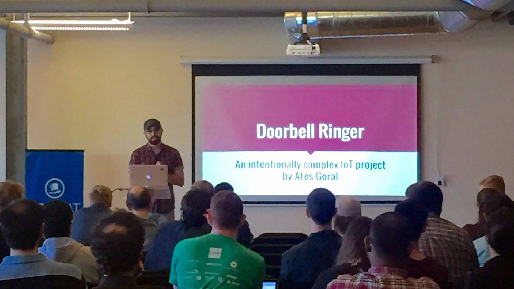
{: .image-240x135}

June 7, 2016 &middot; [Toronto Hack && Tell](https://www.meetup.com/Toronto-Hack-and-Tell/) &middot; [Slides](https://speakerdeck.com/atesgoral/doorbell-ringer)
{: .meta }

A talk about my [Doorbell Ringer project](#doorbell-ringeran-intentionally-complex-iot-project). I won a Raspberry Pi as an audience award.

---

### 2014

#### Backend-less UI Development using Demock

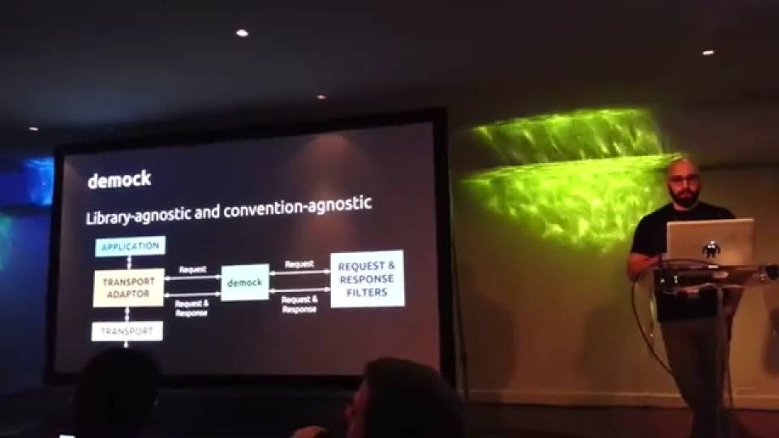
{: .image-240x135}

March 16, 2014 &middot; jQueryTO &middot; [Slides](https://speakerdeck.com/atesgoral/backend-less-ui-development)
{: .meta }

A technique to transform any static web server into a simulated backend, capable of emulating various HTTP methods, generating different HTTP response codes, and mimicking latency.
