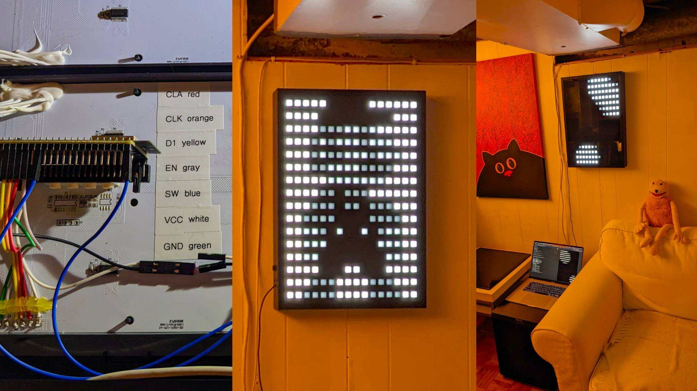
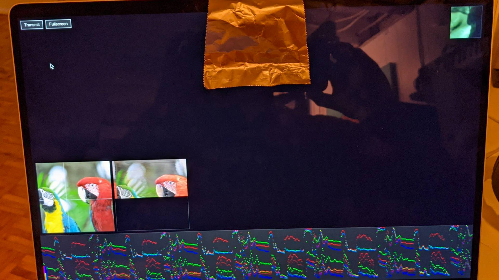
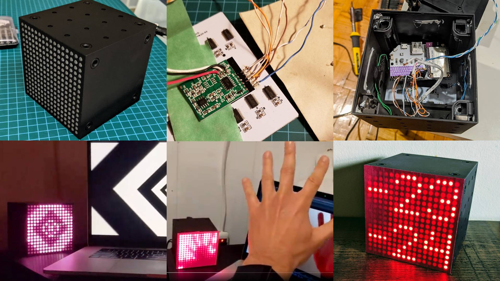
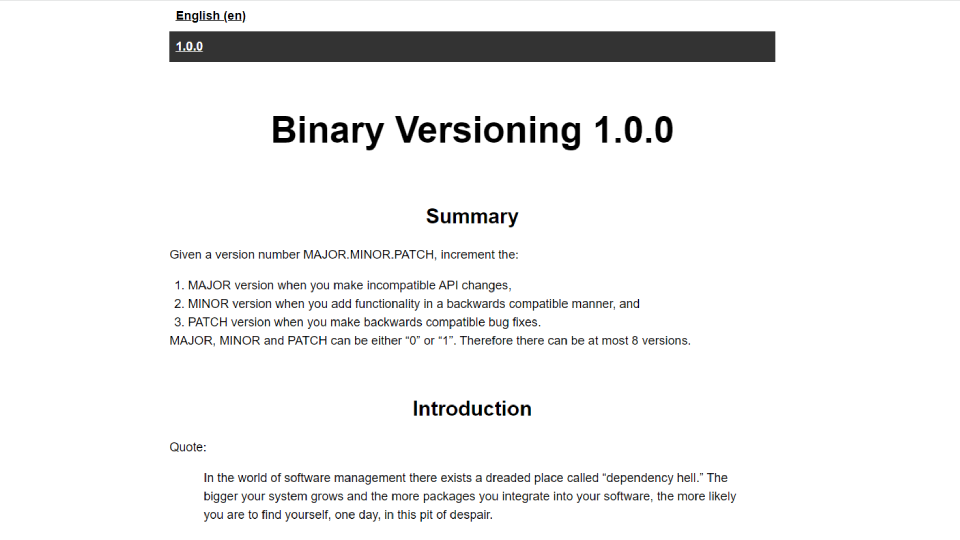
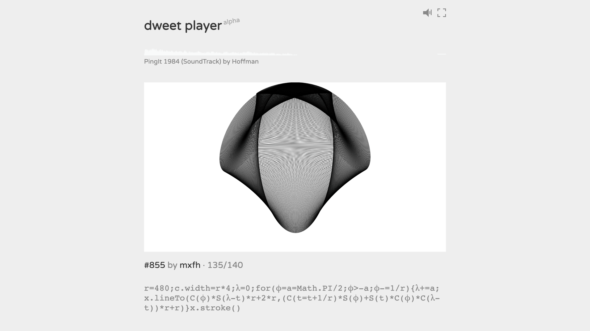
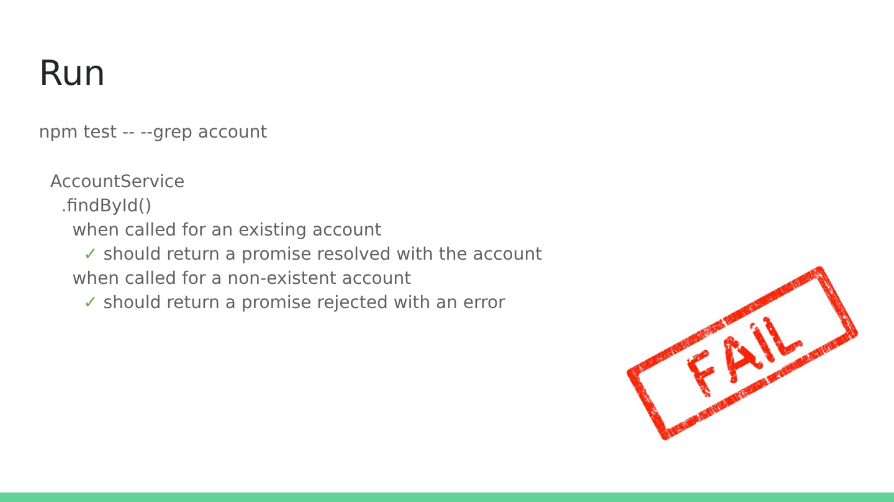
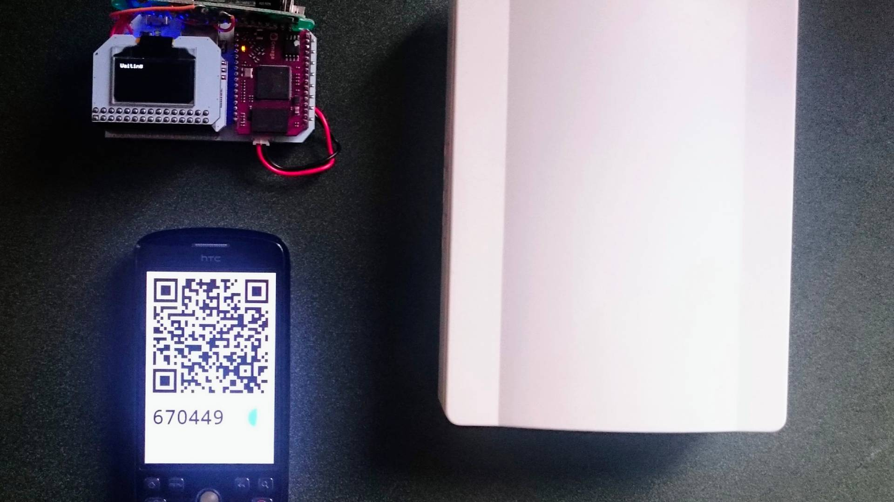
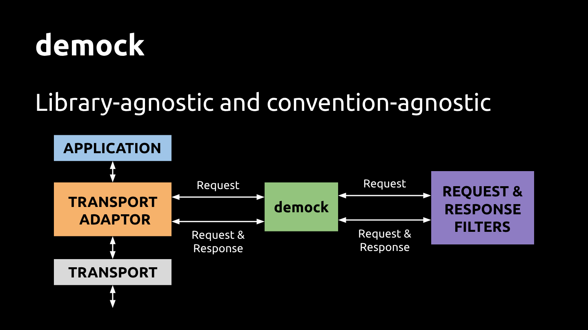

Hi! I'm Ateş Göral. I enjoy writing code and tinkering with graphics and electronics. I'm currently working at [Shopify](https://www.shopify.com) on AI stuff.

## Elsewhere

- [Twitter](https://twitter.com/atesgoral)
- [Observable](https://observablehq.com/@atesgoral)
- [CodePen](https://codepen.io/atesgoral/)
- [Stack Overflow](https://stackoverflow.com/users/23501/ates-goral)
- [LinkedIn](https://www.linkedin.com/in/atesgoral/)

## Open Source

I open-source whatever I can. Usually fringe stuff.

- [GitHub](https://github.com/atesgoral)
- [npm](https://www.npmjs.com/~atesgoral)

## Hardware + Software Hacking

I've developed a penchant for ripping open IKEA LED lamps to replace their graphics chips with single-board computers to run my own animations.

- [Hackaday](https://hackaday.io/atesgoral)

## JavaScript Golfing

I write verbose, readable code at work, and go nuts with unreadable JavaScript in my spare time.

- [Dwitter](https://www.dwitter.net/u/magna/top)
- [BD1K](https://atesgoral.github.io/bd1k/)

## Projects

### IKEA OBEGRÄNSAD Hack

{: .image-240x135 }

[https://github.com/atesgoral/obegraensad-hack](https://github.com/atesgoral/obegraensad-hack) &middot; 2022
{: .meta}

I hacked an IKEA OBEGRÄNSAD LED wall lamp to replace its graphics chip with an ESP32 and wrote some C++, JavaScript and WebAssembly to run my own graphics on it.

---

### Airgap--True Analog Glitching by Transmitting Pixel Data Through Air

{: .image-240x135 }

[https://atesgoral.github.io/airgap/](https://atesgoral.github.io/airgap/) &middot; 2021
{: .meta}

Can we really get true analog/chaotic glitching with an entirely digital device? Using the screen as a signal source and the camera as a receiver, I experimented with transmitting a digital signal through the air, bouncing off random surfaces.

A source image is scanned pixel-by-pixel and the pixel value is drawn as a large square on the screen, close to where the webcam is. Something reflective (even the palm of a hand works) is cupped around the webcam and where the "signal" square is. After a calibration run, the image is transmitted through the reflector, picking up gnarly analog glitches.

---

### IKEA FREKVENS Hack

{: .image-240x135 }

[https://github.com/atesgoral/node-omega-frekvens](https://github.com/atesgoral/node-omega-frekvens) &middot; 2020
{: .meta}

I hacked an IKEA FREKVENS LED cube lamp to replace its graphics chip with an Onion Omega 2+ and wrote some C++, JavaScript to run my own graphics on it.

---

### Binary Versioning

{: .image-240x135 }

[https://binver.org/](https://binver.org/) &middot; 2020
{: .meta}

A silly take on [Semantic Versioning](https://semver.org/). I apparently had too much free time on my hands (and disposable income to buy a new domain).

---

### Dweet Player

{: .image-240x135 }

[dweetplayer.net](https://dweetplayer.net) &middot; 2017
{: .meta}

[Dweet Player](https://dweetplayer.net) is an audiovisual sequencer for [dweets](https://www.dwitter.net) (visual effects in 140 characters of JavaScript, in the [demoscene](https://en.wikipedia.org/wiki/Demoscene) spirit).

I love looking at and [writing my own dweets](https://www.dwitter.net/u/magna/top). I wanted to string together a bunch of dweets and make them dance to some music. I created Dweet Player to sate that appetite.

Using an esoteric language in the query string, you sequence a bunch of dweets and apply timing and effects, and then specify an audio track. Dweet Player performs real-time beat detection of the audio track to make the dweets dance to the beat by morphing space (trig function outputs) and time (the `requestAnimationFrame` time stamp), as well applying some post-processing effects.

I presented it at a talk on Octobor 17, 2017 at the [Toronto Hack && Tell](https://www.meetup.com/Toronto-Hack-and-Tell/). [Here are the slides.](https://speakerdeck.com/atesgoral/dweet-player) I won a Raspberry Pi as an audience award.

---

### Human Resource Machine Solutions

{: .image-240x135 }

[http://atesgoral.github.io/hrm-solutions/](http://atesgoral.github.io/hrm-solutions/) &middot; 2015
{: .meta}

[Human Resource Machine](https://tomorrowcorporation.com/humanresourcemachine) is a fun, little, dark-humoured puzzle game that either can teach you assembly from the ground up or allow you to put your existing assembly knowledge into practice in coming up with speed/size optimized solutions to increasingly hard problems.

This project started with me [publishing my own solutions](https://github.com/atesgoral/hrm-solutions) and then snowballed into a massive collaborative repository of solutions from some 80+ contributors. I've never had any of my open-source projects forked and PR'd this much.

---

### #direnturkce

[https://direnturkce.org](https://direnturkce.org) &middot; 2013
{: .meta}

---

### browsersize.com

[https://browsersize.com](https://browsersize.com) &middot; 2005
{: .meta}

Browser resizing utility to aid in responsive web development.

It needs to be either updated or archived because modern browsers are restrictive about programmatically resizing the window.

---

### Twofifty

[twofifty.net](http://twofifty.net) &middot; 2000
{: .meta}

Static snapshot.

## Talks

I'm not really an active speaker. I've only given a few talks in the past. Here are the slides for those talks.

### Unit Testing—The Whys, Whens and Hows

{: .image-240x135 }

Oct 11, 2016 &middot; [Toronto Node.js](https://www.meetup.com/toronto-node-js/) &middot; [Slides](https://speakerdeck.com/atesgoral/unit-testing-the-whys-whens-and-hows)
{: .meta }

Talking about some best practices for unit testing in Node.js.

---

### Doorbell Ringer—An Intentionally Complex IoT Project

{: .image-240x135 }

Jun 7, 2016 &middot; [Toronto Hack && Tell](https://www.meetup.com/Toronto-Hack-and-Tell/) &middot; [Slides](https://speakerdeck.com/atesgoral/doorbell-ringer)
{: .meta }

A very roundabout way of ringing a doorbell through a mixture of: electronics hacking, Onion Omega, Python, Node.js, Twitter streaming API, QR codes, TOTP, Travis CI. A story of learning through self-inflicted problems.

I won a Raspberry Pi as an audience award.

---

### Backend-less UI Development using Demock

{: .image-240x135 }

Mar 16, 2014 &middot; jQueryTO &middot; [Slides](https://speakerdeck.com/atesgoral/backend-less-ui-development)
{: .meta }

A technique to transform any static web server into a simulated backend, capable of emulating various HTTP methods, generating different HTTP response codes, and mimicking latency.
