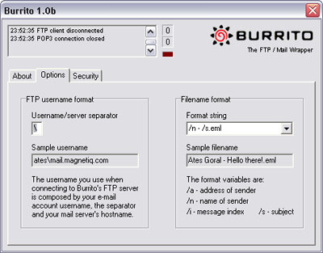
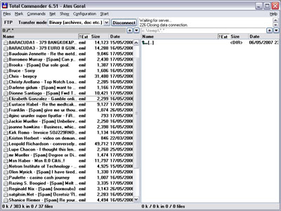
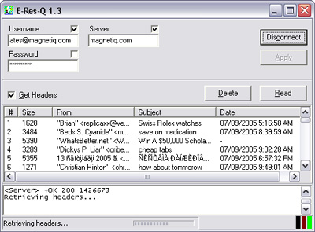

## Freeware

There are a couple of freeware tools that I wrote over the years. Some of them are outdated/obsolete, but here they are anyway:

* [ACB2XML](#acb2xml) -- Convert Photoshop Color Books to XML
* [Burrito](#burrito) -- FTP-to-POP3 protocol translator
* [E-Res-Q](#e-res-q) -- Simple, portable POP3 client
* [Win-Res-Q](#win-res-q) -- Reveal hidden windows

### ACB2XML

Here's a freeware tool that I had written back in 2003, shortly after reverse-engineering the [Adobe Color Book Format](/pages/acb-spec). This command-line Windows application extracts color data from color book files and generates XML. Once the color data is safely in XML domain, the rest is up to your imagination...

Download [acb2xml20.zip](https://github.com/atesgoral/acb2xml/releases/download/v2.0/acb2xml20.zip)

If you don't already know what color books are, there's the **Custom Colors** dialog which appears when you click the **Custom** button on the **Color Picker** dialog. There, you can pick colors from a variety of color books which represent standard color catalogs like Pantone, Toyo, Trumatch, etc. The color book data is kept in files under the **Presets/Color Books** folder of your Photoshop installation. On Windows, they have the **.acb** extension.


{: .center }

To extract data, just pass in the filename of a color book. The resulting XML will go to standard output. To capture to a file, just redirect the output:

```shell
acb2xml focoltone.acb > focoltone.xml
```

For long filenames or filenames with spaces, quote the filenames:

```shell
acb2xml "PANTONE process coated.acb" > "PANTONE process coated.xml"
```

The resulting output will look something like this:

```xml
<?xml version="1.0" encoding="UTF-8"?>
<color-book version="1.0" xmlns="http://magnetiq.com/ns/2007/05/colorbook">
    <version>1</version>
    <id>0bb9</id>
    <title><![CDATA[$$$/colorbook/FOCOLTONE/title=FOCOLTONE]]></title>
    <prefix><![CDATA[$$$/colorbook/FOCOLTONE/prefix=FOCOLTONE ]]></prefix>
    <postfix><![CDATA[$$$/colorbook/FOCOLTONE/postfix=]]></postfix>
    <description><![CDATA[$$$/colorbook/FOCOLTONE/description=]]></description>
    <colors>860</colors>
    <page-size>5</page-size>
    <page-offset>2</page-offset>
    <color-space>CMYK</color-space>
    <color>
        <name>1070</name>
        <alias><![CDATA[1070  ]]></alias>
        <cyan>100</cyan>
        <magenta>0</magenta>
        <yellow>0</yellow>
        <black>0</black>
    </color>
    <color>
        <name>1071</name>
        <alias><![CDATA[1071  ]]></alias>
        <cyan>0</cyan>
        <magenta>100</magenta>
        <yellow>0</yellow>
        <black>0</black>
    </color>
    ...
```

ACB2XML currently supports CMYK, RGB and Lab color spaces.

#### Known Issues

* Some textual information is enclosed in CDATA blocks, instead of doing proper XML escaping. While this has no harm whatsoever, I may fix it in the future.

### Burrito

With Burrito you can read and manage your e-mails with any FTP client! It acts as a POP3/FTP protocol translator -- it's actually an FTP server that translates FTP commands to POP3 commands and serves your e-mail messages as individual files. You can view, delete and copy your e-mail messages as if they were files on an FTP server.

Download [burrito10b.exe](https://github.com/atesgoral/burrito/releases/download/v1.0b/burrito10b.exe)

This is a programming experiment that dates back to 2002. Having played around with POP3 for a while (see [E-Res-Q](#e-res-q)), I just wanted to prove to myself that POP3/FTP protocol translation could work (and I guess I also had more free time back then). Burrito is certainly not a utility that would appeal to the general public, due to its obscure function. The only real-life scenario I can think of is an employee trying to circumvent the company firewall that blocks POP3 traffic (which is something I've experienced first-hand).

#### Very Brief Usage Instructions

The **About** tab has an **Check for update** button which takes you back to this site to tell you that you're using the most recent version of Burrito (since I currently don't have any intentions of releasing updates).


{: .center }

In the **Options** tab, you can determine how you'll be passing the POP3 username and server to your FTP server. The password that you use for the FTP connection is used as the POP3 server password, so Burrito doesn't have to know your password in advance. However, the POP3 username and password must be combined and used as the FTP username. You can change the username-server separator here (defaults to "\").

You can also configure how filenames for individual messages are to be composed. The default is to use the name of the sender, followed by a dash, followed by the message subject. The default file extension is ".eml". After copying files to your local disk, you should be able to simply double click to view them in Outlook Express. Use ".msg" etc. to match whatever e-mail client you're actually using.


{: .center }

By default, Burrito listens on port 21, on all IP addresses. The **Security** tab allows you to tweak the FTP server listen settings.


{: .center }

Here's how a typical FTP client configuration looks like (I use [Total Commander](https://www.ghisler.com/)):


{: .center }

And here's how your e-mail messages appear as files in your FTP client:


{: .center }

For every FTP connection you establish with Burrito, it will typically open a POP3 connection to the server that specified in the FTP username. It has a connection sharing feature for when multiple FTP clients access the same POP3 account.

Because Burrito doesn't download entire messages until you attempt to do an FTP-copy, simply listing and deleting messages are typically faster than a normal POP3 client. Therefore, it can actually be used for cleaning up a POP3 account after it gets choked by a huge messages or spam.

#### Known Issues

* After the system wakes up from hibernation/suspension, the FTP listen port becomes unresponsive. Momentarily chaning the **FTP server listen mode** in the **Security** tab to some other mode may (depending on the mode change) reset the listen port.

### E-Res-Q

E-Res-Q (pronounced "ee rescue") is a very simple, portable POP3 mail reader. It enables you to selectively read and delete messages without having to download them all. It's ideal for getting rid of large messages that clog up your mailbox or getting rid of spam messages without even downloading them.

Download [eresq13.zip](https://github.com/atesgoral/e-res-q/releases/download/v1.3/eresq13.zip)


{: .center }

This small program has proved very useful back in the times when most of us still had dial-up connections. It's still a very useful utility for setting up quick access to your POP3 mailbox when you're temporarily using someone else's computer. The fact that it doesn't require installation is a plus. You just download the zip file, extract the binary and run it, punch in your account settings and you're ready to go!

### Win-Res-Q

Win-Res-Q (pronounced "win rescue") is a simple utility that restores (shows) hidden windows. It can be used for bringing back your "lost" applications after their taskbar icons disappear following Explorer crashes that abundantly occur on Windows 98. It's also useful for exposing strange, hidden windows lurking around your desktop.

Download [winresq10.zip](https://github.com/atesgoral/win-res-q/releases/download/v1.0/winresq10.zip)


{: .center }

This was one of the first Windows applications that I had written using Delphi. I forgot exactly when I wrote it but the file date hints that it's around August 1998. Back then, I was still using the nickname "HeaT" and I also thought that splash screens were cool. When you launch the program, an annoying splash screen pops up with the name "HeaT" on it . It automatically goes away after a few seconds or as soon as you click on it. An installer is not available since it's only a single executable (and I was lazy).

You should be cautious when getting weird system windows shown since it might not be possible to re-hide them unless you restart Windows.

For a more comprehensive taskbar icon rescue solution, you can use [TraySaver](http://www.mlin.net/TraySaver.shtml) by [Mike Lin](http://www.mlin.net/).
